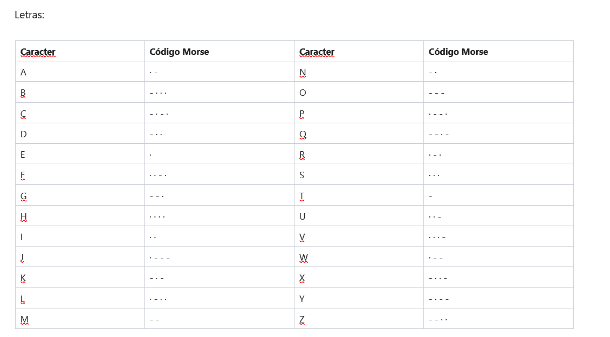
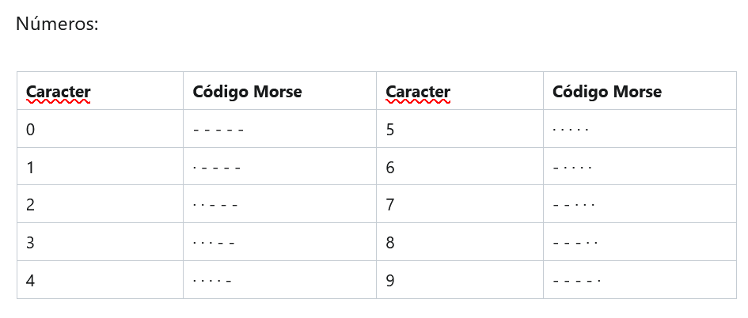
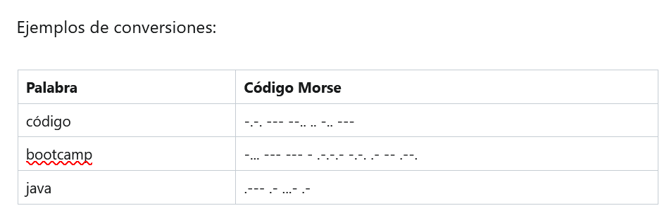
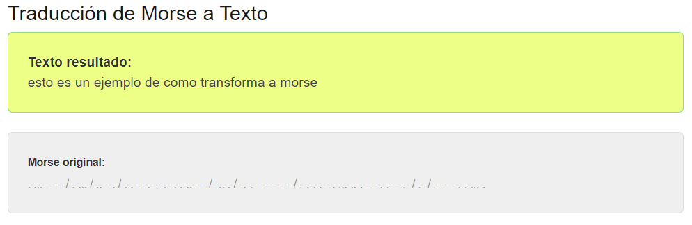

# Ejercicio Nº 2 y 3: Desafío del código Morse 

El sistema Morse permite cifrar cada grafema del alfabeto como una secuencia de "puntos" y "rayas" o “líneas”. Por ejemplo, la letra S se cifra como · · ·, la letra T se cifra como − y el número 7 se cifra como · · - - -

El código Morse no hace diferencia entre mayúsculas y minúsculas, sin embargo sus conversiones comúnmente se presentan en letras en mayúscula (por convención). Al redactar el mensaje un código Morse, se utiliza un solo espacio para separar los códigos de grafemas y se emplean 3 espacios para separar palabras.

En base a esto, realizar una API que sea capaz de descifrar SOLO PALABRAS (no frases) de nuestro alfabeto a código morse. Para ello, el sistema deberá tener en cuenta la siguiente tabla de valores de conversión:







## Pruebas ⚙️

Se introducen las siguientes url: 

http://localhost:8080/morse?texto=esto%20es%20un%20ejemplo%20de%20como%20transforma%20a%20morse

Se obtiene el siguiente resultado: 

```
. ... - --- / . ... / ..- -. / . .--- . -- .--. .-.. --- / -.. . / -.-. --- -- --- / - .-. .- -. ... ..-. --- .-. -- .- / .- / -- --- .-. ... .

```
Si lo pasamos por un traductor de código morse se obtenemos lo siguiente: 



## Autores ✒️

* **Alicia Martínez Maqueda** *https://github.com/aliciamm81*

